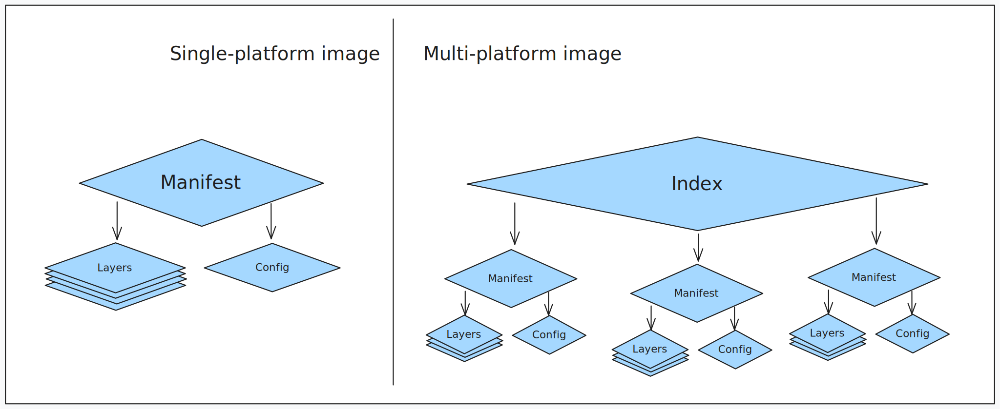

## Disclaimer

Este material tem caráter experimental, técnico e educacional, e foi elaborado com o objetivo de explorar os conceitos de containers Distroless e construções multi-arquitetura (Archless) no contexto de builds modernos com Docker, apko e imagens base como Wolfi Linux.

As abordagens descritas envolvem o uso de imagens mínimas, sem distribuição tradicional (sem shell, package manager ou utilitários de sistema), e a criação de imagens compatíveis com múltiplas arquiteturas como linux/amd64 e linux/arm64, utilizando práticas como manifest lists e OCI standards.

┌────────────────────────────┐
│         Container          │ ← Executável isolado com app + dependências
├────────────────────────────┤
│ 'Distroless' Multi-Arch    │ ← Imagem mínima e sem distro, suporta várias arquiteturas (ex: amd64, arm64)
├────────────────────────────┤
│            SBOM            │ ← Lista completa dos pacotes e binários presentes (ex: SPDX, CycloneDX)
├────────────────────────────┤
│           Layers           │ ← Camadas imutáveis de filesystem (read-only), empilhadas em overlay
├────────────────────────────┤
│         Namespaces         │ ← Isolamento de recursos: PID, Mount, UTS, IPC, Network, User
├────────────────────────────┤
│          cgroups           │ ← Limitação e contabilidade de recursos (CPU, memória, IO, etc)
├────────────────────────────┤
│         containerd         │ ← Runtime que executa e gerencia containers, controlado via CRI (ex: pelo kubelet)
├────────────────────────────┤
│      Linux Kernel / OS     │ ← Executa syscalls e coordena namespaces, cgroups e imagens via overlayfs
├────────────────────────────┤
│          Hardware          │ ← CPU, memória, disco, rede (arquitetura física: amd64, arm64, etc)
└────────────────────────────┘


## Distroless

[](./img/distroless-logo.svg)

"Distroless" images contain only your application and its runtime dependencies. They do not contain package managers, shells or any other programs you would expect to find in a standard Linux distribution.

For more information, see this talk [](video).

Since March 2023, Distroless images use oci manifests, if you see errors referencing application/vnd.oci.image.manifest.v1+json or application/vnd.oci.image.index.v1+json, update your container tooling (docker, jib, etc) to latest.

## Multi-arquitetura
Understand Multi-platform builds (Archless)

A multi-platform build refers to a single build invocation that targets multiple different operating system or CPU architecture combinations. When building images, this lets you create a single image that can run on multiple platforms, such as `linux/amd64`, `linux/arm64`, and `windows/amd64`.

Difference between single-platform and multi-platform images
Multi-platform images have a different structure than single-platform images. Single-platform images contain a single manifest that points to a single configuration and a single set of layers. Multi-platform images contain a manifest list, pointing to multiple manifests, each of which points to a different configuration and set of layers.



When you push a multi-platform image to a registry, the registry stores the manifest list and all the individual manifests. When you pull the image, the registry returns the manifest list, and Docker automatically selects the correct variant based on the host's architecture. For example, if you run a multi-platform image on an ARM-based Raspberry Pi, Docker selects the linux/arm64 variant. If you run the same image on an x86-64 laptop, Docker selects the linux/amd64 variant (if you're using Linux containers).

## Show me the works

Estrutura do repositório:

```shell
.
├── distroless
│   └── wolfi-base.yaml    >> Arquivo base para criação da imagem
└── frameworks             >> Arquivos de imagens base
    ├── java17.yaml
    └── python3-11.yaml
```

### build imagem amd64

```
REGISTRY=gersontpc

# Listar os arquivos no diretório frameworks e remover as extensões
for FRAMEWORK in $(ls ./frameworks | sed 's/\.[^.]*$//'); do
  # Para cada framework, gerar imagens para amd64 e arm64
  for ARCH in amd64 arm64; do
    apko build --arch "$ARCH" "frameworks/${FRAMEWORK}.yaml" "${REGISTRY}/${FRAMEWORK}" "${FRAMEWORK}-${ARCH}.tar"
    docker load < "${FRAMEWORK}-${ARCH}.tar"
  done

  # Criar a imagem multi-arquitetura para o framework atual
  docker buildx imagetools create \
    --tag "${REGISTRY}/${FRAMEWORK}-base:multiarch" \
    "${FRAMEWORK}-amd64.tar" \
    "${FRAMEWORK}-arm64.tar"
done
```


```
REGISTRY=gersontpc

# Listar os arquivos no diretório frameworks e remover as extensões
for FRAMEWORK in $(ls ./frameworks | sed 's/\.[^.]*$//'); do
  echo "Para cada framework, gerar imagens para amd64 e arm64"
  for ARCH in amd64 arm64; do
    apko build --arch "$ARCH" "frameworks/${FRAMEWORK}.yaml" "${REGISTRY}/${FRAMEWORK}" "${FRAMEWORK}-${ARCH}.tar"
    docker load < "${FRAMEWORK}-${ARCH}.tar"

    # Fazer o push da imagem para o Docker Hub
    docker push "${REGISTRY}/${FRAMEWORK}:latest-${ARCH}"
  done

  echo "Criar a imagem multi-arquitetura para o framework atual"
  docker buildx imagetools create \
    --tag "${REGISTRY}/${FRAMEWORK}-base:multiarch" \
    "${REGISTRY}/${FRAMEWORK}:latest-amd64" \
    "${REGISTRY}/${FRAMEWORK}:latest-arm64"

  echo "Fazer o push da imagem multi-arquitetura"
  docker push "${REGISTRY}/${FRAMEWORK}-base:multiarch"
done
```


docker buildx imagetools create --tag ${REGISTRY}$/java17-base:multiarch  java17-${ARCH}.tar


for FILE in ./frameworks/*; do
  echo "$(basename "$FILE" .${FILE##*.})"
done

ls ./frameworks | sed 's/\.[^.]*$//'

```shell
docker load < java17.tar
```

```
a3a0ef6619fb: Loading layer [==================================================>]  98.27MB/98.27MB
Loaded image: java17:latest-amd64
```

```

```


docker manifest inspect gersontpc/image-base:multiarch

docker sbom gersontpc/image-base:multiarch
grype gersontpc/image-base:multiarch


docker run --rm -v ${PWD}:/work -w /work cgr.dev/chainguard/apko build --arch amd64 frameworks/java.yaml wolfi-base1 wolfi-test1.tar

docker buildx imagetools create \\n  --tag gersontpc/image-base:multiarch \\n  gersontpc/wolfi-base:amd64-amd64 \\n  gersontpc/wolfi-base:arm64-arm64


## References

### apko file reference
https://github.com/chainguard-dev/apko/blob/main/docs/apko_file.md. 
https://github.com/chainguard-dev/apko/blob/main/config/task.yaml

### Version
https://edu.chainguard.dev/open-source/wolfi/apk-version-selection/

https://github.com/docker/setup-qemu-action


docker buildx build --platform=linux/amd64,linux/arm64 .


REGISTRY=gersontpc

# Listar os arquivos no diretório frameworks e remover as extensões
for FRAMEWORK in $(ls ./frameworks | sed 's/\.[^.]*$//'); do
  # Para cada framework, gerar imagens para amd64 e arm64
  for ARCH in amd64 arm64; do
    apko build --arch "$ARCH" "frameworks/${FRAMEWORK}.yaml" "${REGISTRY}/${FRAMEWORK}" "${FRAMEWORK}-${ARCH}.tar"
    docker load < "${FRAMEWORK}-${ARCH}.tar"
  done

  # Criar a imagem multi-arquitetura para o framework atual
  docker buildx imagetools create \
    --tag "${REGISTRY}/${FRAMEWORK}-base:multiarch" \
    "${FRAMEWORK}-amd64.tar" \
    "${FRAMEWORK}-arm64.tar"

  # Fazer o push da imagem multi-arquitetura
  echo "Fazendo o push da imagem multi-arquitetura para o Docker Hub"
  docker push "${REGISTRY}/${FRAMEWORK}-base:multiarch"
done

```

REGISTRY=gersontpc

# Listar os arquivos no diretório frameworks e remover as extensões
for FRAMEWORK in $(ls ./frameworks | sed 's/\.[^.]*$//'); do
  echo "Para cada framework, gerar imagens para amd64 e arm64"
  for ARCH in amd64 arm64; do
    apko build --arch "$ARCH" "frameworks/${FRAMEWORK}.yaml" "${REGISTRY}/${FRAMEWORK}" "${FRAMEWORK}-${ARCH}.tar"
    docker load < "${FRAMEWORK}-${ARCH}.tar"
  done

  echo 'Criar a imagem multi-arquitetura para o framework:' ${FRAMEWORK}
  docker buildx imagetools create \
    --tag "${REGISTRY}/${FRAMEWORK}-base:multiarch" \
    "${REGISTRY}/${FRAMEWORK}:latest-amd64" \
    "${REGISTRY}/${FRAMEWORK}:latest-arm64"

  echo "Fazer o push da imagem multi-arquitetura"
  docker push "${REGISTRY}/${FRAMEWORK}-base:multiarch"
done
```

REGISTRY=gersontpc
PLATFORMS=arm64,amd64

# Listar os arquivos no diretório frameworks e remover as extensões
for FRAMEWORK in $(ls ./frameworks | sed 's/\.[^.]*$//'); do
  echo "Para cada framework, gerar imagens para amd64 e arm64"
  for ARCH in ${PLATFORMS} ; do
    apko build --arch "$ARCH" "frameworks/${FRAMEWORK}.yaml" "${REGISTRY}/${FRAMEWORK}" "${FRAMEWORK}-${ARCH}.tar"
    docker load < "${FRAMEWORK}-${ARCH}.tar"
  done

  echo "Criar a lista de manifestos para o framework: ${FRAMEWORK}"
  docker manifest create "${REGISTRY}/${FRAMEWORK}-multiarch:latest" \
    "${REGISTRY}/${FRAMEWORK}:latest-amd64" \
    "${REGISTRY}/${FRAMEWORK}:latest-arm64"

  echo "Anotar as arquiteturas para o manifesto"
  docker manifest annotate "${REGISTRY}/${FRAMEWORK}-multiarch:latest" "${REGISTRY}/${FRAMEWORK}:latest-amd64" --os linux --arch amd64
  docker manifest annotate "${REGISTRY}/${FRAMEWORK}-multiarch:latest" "${REGISTRY}/${FRAMEWORK}:latest-arm64" --os linux --arch arm64

  echo "Fazer o push da imagem multi-arquitetura"
  docker manifest push "${REGISTRY}/${FRAMEWORK}-multiarch:latest"
done


#!/bin/bash

REGISTRY=gersontpc
PLATFORMS=("arm64" "amd64")

# Listar os arquivos no diretório frameworks e remover as extensões
for FRAMEWORK_FILE in ./frameworks/*.yaml; do
  FRAMEWORK=$(basename "$FRAMEWORK_FILE" .yaml)
  echo "Processando framework: $FRAMEWORK"

  # Gerar imagens para cada arquitetura
  for ARCH in "${PLATFORMS[@]}"; do
    echo "Gerando imagem para $FRAMEWORK na arquitetura $ARCH"
    apko build --arch "$ARCH" "$FRAMEWORK_FILE" "${REGISTRY}/${FRAMEWORK}" "${FRAMEWORK}-${ARCH}.tar"
    docker load < "${FRAMEWORK}-${ARCH}.tar"
  done

  # Criar a lista de manifestos
  echo "Criando a lista de manifestos para o framework: $FRAMEWORK"
  docker manifest create "${REGISTRY}/${FRAMEWORK}-multiarch:latest" \
    "${REGISTRY}/${FRAMEWORK}:latest-arm64" \
    "${REGISTRY}/${FRAMEWORK}:latest-amd64"

  # Anotar as arquiteturas no manifesto
  echo "Anotando arquiteturas no manifesto para $FRAMEWORK"
  for ARCH in "${PLATFORMS[@]}"; do
    docker manifest annotate "${REGISTRY}/${FRAMEWORK}-multiarch:latest" \
      "${REGISTRY}/${FRAMEWORK}:latest-${ARCH}" --os linux --arch "$ARCH"
  done

  # Fazer o push da imagem multi-arquitetura
  echo "Fazendo o push da imagem multi-arquitetura para $FRAMEWORK"
  docker manifest push "${REGISTRY}/${FRAMEWORK}-multiarch:latest"
done


https://github.com/chainguard-dev/apko/blob/main/docs/apko_file.md