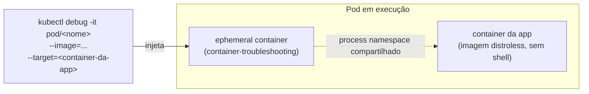
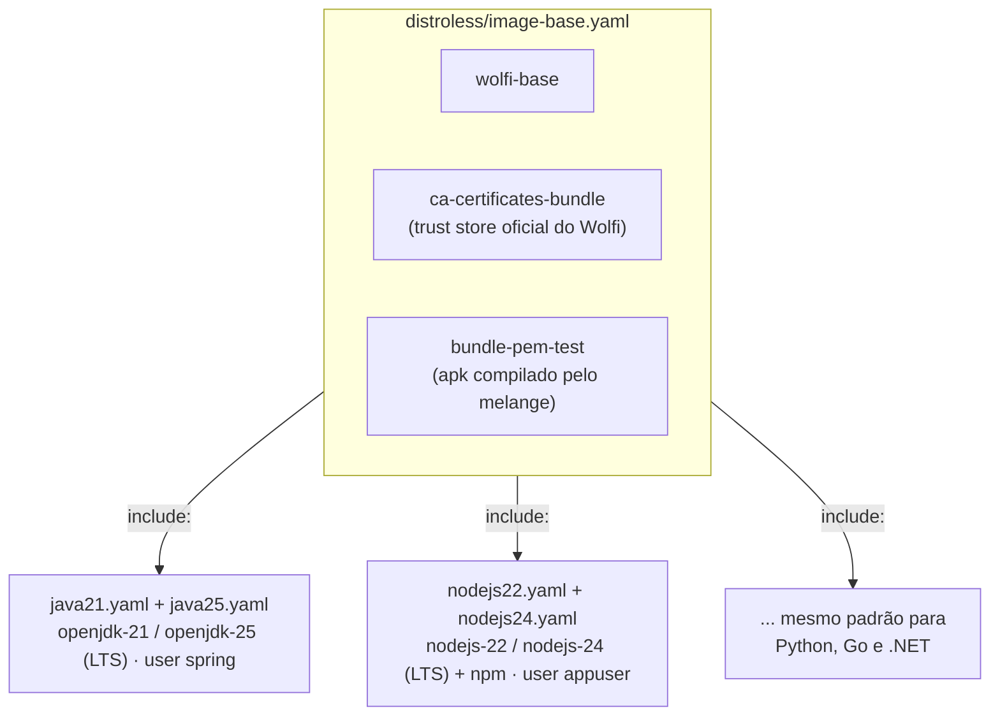
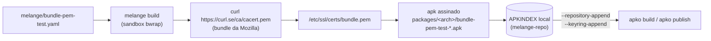
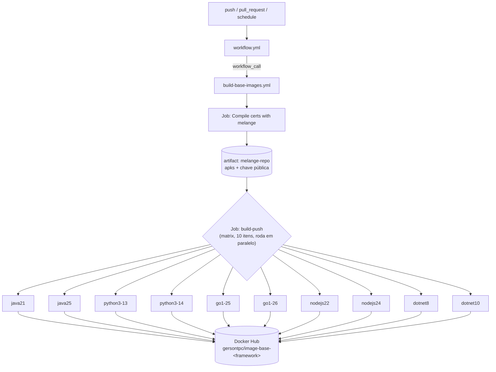

# image-base

Imagens base **distroless multi-arquitetura** (`amd64`/`arm64`) para **Java, Python, Go, Node.js e .NET** — cada linguagem com **duas versões estáveis/LTS** publicadas em paralelo. Construídas com [apko](https://github.com/chainguard-dev/apko) + [melange](https://github.com/chainguard-dev/melange) (pacotes [Wolfi](https://github.com/wolfi-dev), sem Dockerfile), escaneadas com [Trivy](https://github.com/aquasecurity/trivy) e publicadas no Docker Hub via um workflow reusável do GitHub Actions.

<p align="center">
  
</p>

## Índice

- [O que é uma imagem Distroless?](#o-que-é-uma-imagem-distroless)
- [Imagens disponíveis](#imagens-disponíveis)
- [Como usar](#como-usar)
- [Troubleshooting com Ephemeral Container](#troubleshooting-com-ephemeral-container)
- [Estrutura do repositório](#estrutura-do-repositório)
- [Como as imagens são compostas](#como-as-imagens-são-compostas)
- [O pacote `bundle-pem-test` (melange)](#o-pacote-bundle-pem-test-melange)
- [Pipeline de CI/CD (GitHub Actions)](#pipeline-de-cicd-github-actions)
- [Build local](#build-local)

## O que é uma imagem Distroless?

Imagens "Distroless" contêm apenas o aplicativo e suas dependências de tempo de execução — sem gerenciador de pacotes, shell ou qualquer outra ferramenta que normalmente vem junto de uma distribuição Linux padrão. Restringir o container de produção precisamente ao que a aplicação precisa reduz a superfície de ataque e é uma prática recomendada, principalmente em ambientes produtivos.

> Como não há shell nem ferramentas de troubleshooting na imagem, para depurar um pod rodando distroless é necessário anexar um [Container Efêmero](https://kubernetes.io/docs/tasks/debug/debug-application/debug-running-pod/#ephemeral-container) — um container "canivete suíço" que se conecta ao pod da aplicação para investigação.

Neste repositório isso se traduz em quatro garantias concretas, já padronizadas em todas as imagens:

- **Camada única (single layer):** o `apko` não empilha `RUN` como um Dockerfile faz — ele resolve o grafo de dependências dos pacotes Wolfi e escreve o resultado final numa única camada, sem cache de gerenciador de pacotes, arquivo temporário ou camada intermediária "fantasma" sobrando na imagem publicada.
- **Superfície de ataque mínima:** cada `frameworks/<nome>.yaml` só declara o runtime que precisa (ex.: `openjdk-21`) — sem shell, gerenciador de pacotes, compilador ou ferramentas de rede além do estritamente necessário. Todas as imagens rodam como usuário non-root por padrão (`spring` ou `appuser`, uid/gid 10000).
- **Cadeia de suprimentos (supply chain) rastreável:** os pacotes vêm do repositório rolling-release do [Wolfi](https://github.com/wolfi-dev) (assinado e mantido pela Chainguard); o único pacote que não vem de lá (`bundle-pem-test`) é compilado neste próprio repositório via melange, com índice assinado por uma chave efêmera gerada a cada build. Não existe imagem base de terceiros nem `FROM` de uma tag de procedência desconhecida.
- **SBOM e scan em todo build:** o `apko` gera um SBOM (SPDX) a cada build, e o [Trivy](#pipeline-de-cicd-github-actions) escaneia a imagem localmente antes de qualquer push — uma CVE `CRITICAL`/`HIGH` falha o pipeline e a imagem nunca chega a ser publicada.

## Imagens disponíveis

| Linguagem | Versão | Pacote(s) Wolfi | Imagem | Usuário |
|---|---|---|---|---|
| Java | 21 (LTS) | `openjdk-21` | `gersontpc/image-base-java21` | `spring` |
| Java | 25 (LTS) | `openjdk-25` | `gersontpc/image-base-java25` | `spring` |
| Python | 3.13 | `python-3.13` | `gersontpc/image-base-python3-13` | `appuser` |
| Python | 3.14 | `python-3.14` | `gersontpc/image-base-python3-14` | `appuser` |
| Go | 1.25 | `go-1.25` | `gersontpc/image-base-go1-25` | `appuser` |
| Go | 1.26 | `go-1.26` | `gersontpc/image-base-go1-26` | `appuser` |
| Node.js | 22 (LTS) | `nodejs-22`, `npm`, `busybox` | `gersontpc/image-base-nodejs22` | `appuser` |
| Node.js | 24 (LTS) | `nodejs-24`, `npm`, `busybox` | `gersontpc/image-base-nodejs24` | `appuser` |
| .NET | 8 (LTS) | `dotnet-8-sdk` | `gersontpc/image-base-dotnet8` | `appuser` |
| .NET | 10 (LTS) | `dotnet-10-sdk` | `gersontpc/image-base-dotnet10` | `appuser` |

Cada imagem publicada tem duas tags: **`stable`** (sempre aponta para o último build que passou no scan de vulnerabilidades) e **`<hash-do-commit>-<ddmmaa>`** (referência imutável de um build específico, ex.: `eff8551-010726` para 1º de julho de 2026, em UTC).

## Como usar

```bash
docker pull gersontpc/image-base-nodejs24:stable
```

Todas as imagens já vêm com `work-dir: /app` e rodando como usuário non-root (`spring` para Java, `appuser` para as demais). Um Dockerfile de aplicação normalmente só precisa copiar o código:

```Dockerfile
FROM gersontpc/image-base-nodejs24:stable
COPY --chown=appuser:appuser . .
CMD ["node", "server.js"]
```

Para fixar num build reprodutível (ex.: pipeline de deploy), use a tag imutável em vez de `stable`:

```Dockerfile
FROM gersontpc/image-base-python3-14:eff8551-010726
```

## Troubleshooting com Ephemeral Container

Como as imagens deste repositório não têm shell, `kubectl exec -it <pod> -- sh` falha:

```
OCI runtime exec failed: exec failed: unable to start container process: exec: "sh": executable file not found in $PATH: unknown
command terminated with exit code 127
```

Para depurar um pod em produção sem alterar a imagem da aplicação, anexe um [Ephemeral Container](https://kubernetes.io/docs/tasks/debug/debug-application/debug-running-pod/#ephemeral-container) — um container temporário, injetado pelo próprio Kubernetes no pod já em execução, com um "canivete suíço" de ferramentas de troubleshooting. Ele compartilha o namespace de processos com o container da aplicação, então dá pra inspecionar (`ps`, `curl`, `tcpdump`, etc.) o que está rodando sem precisar de shell na imagem original.

Este repositório traz esse toolkit em [`container-troubleshooting/Dockerfile`](container-troubleshooting/Dockerfile) (bash, curl, jq, yq, tcpdump, vim, net-tools, aws-cli, entre outros):


```mermaid
flowchart LR
    subgraph POD["Pod em execução"]
        APP["container da app<br/>(imagem distroless, sem shell)"]
        EPH["ephemeral container<br/>(container-troubleshooting)"]
    end
    DEV["kubectl debug -it pod/&lt;nome&gt;<br/>--image=...<br/>--target=&lt;container-da-app&gt;"] -- injeta --> EPH
    EPH -. "process namespace compartilhado" .-> APP
```

```bash
# builde e publique o toolkit (uma vez)
docker build -t gersontpc/container-troubleshooting:latest ./container-troubleshooting
docker push gersontpc/container-troubleshooting:latest

# anexe como ephemeral container num pod já rodando
kubectl debug -it pod/<nome-do-pod> \
  --image=gersontpc/container-troubleshooting:latest \
  --target=<nome-do-container-da-app> \
  -- sh
```

## Estrutura do repositório

Cada pasta tem uma responsabilidade única: `distroless/` define a base comum, `frameworks/` só adiciona o runtime de cada linguagem em cima dela (2 arquivos por linguagem — a versão LTS/estável atual e a anterior), `melange/` builda o pacote extra do `bundle.pem`, `container-troubleshooting/` é o toolkit de debug (veja [Troubleshooting com Ephemeral Container](#troubleshooting-com-ephemeral-container)) e `.github/workflows/` é o pipeline:

```
.
├── .github
│   └── workflows
│       ├── build-base-images.yml   # workflow reusável: build + scan + publish
│       └── workflow.yml            # dispara o pipeline (push/PR/schedule)
├── container-troubleshooting
│   ├── Dockerfile                  # toolkit "canivete suíço" p/ ephemeral container
│   └── README.md
├── distroless
│   └── image-base.yaml             # base comum: wolfi-base + ca-certificates-bundle + bundle-pem-test
├── frameworks
│   ├── dotnet10.yaml                # dotnet-10-sdk (LTS mais recente)
│   ├── dotnet8.yaml                 # dotnet-8-sdk (LTS)
│   ├── go1-25.yaml                  # go-1.25
│   ├── go1-26.yaml                  # go-1.26 (mais recente)
│   ├── java21.yaml                  # openjdk-21 (LTS)
│   ├── java25.yaml                  # openjdk-25 (LTS mais recente)
│   ├── nodejs22.yaml                # nodejs-22 (LTS em manutenção)
│   ├── nodejs24.yaml                # nodejs-24 (LTS ativa)
│   ├── python3-13.yaml               # python-3.13
│   └── python3-14.yaml               # python-3.14 (mais recente)
├── melange
│   └── bundle-pem-test.yaml        # gera o apk com o bundle.pem (Mozilla CA bundle)
├── .gitignore
├── Makefile                        # build local (veja Build local)
└── README.md

7 directories, 19 files
```

## Como as imagens são compostas

Todo `frameworks/<nome>.yaml` usa `include: distroless/image-base.yaml`, herdando os pacotes comuns (o `apko` faz *merge* das listas de pacotes, não substitui) e adicionando só o runtime específico e um usuário non-root próprio:


```mermaid
flowchart TD
    subgraph Base["distroless/image-base.yaml"]
        B1["wolfi-base"]
        B2["ca-certificates-bundle<br/>(trust store oficial do Wolfi)"]
        B3["bundle-pem-test<br/>(apk compilado pelo melange)"]
    end

    Base -- "include:" --> J["java21.yaml + java25.yaml<br/>openjdk-21 / openjdk-25 (LTS) · user spring"]
    Base -- "include:" --> N["nodejs22.yaml + nodejs24.yaml<br/>nodejs-22 / nodejs-24 (LTS) + npm · user appuser"]
    Base -- "include:" --> OUT["... mesmo padrão para<br/>Python, Go e .NET"]
```

(a tabela [Imagens disponíveis](#imagens-disponíveis) acima tem a lista completa e exata dos 10 arquivos)

Critério de escolha das versões (no momento em que este README foi escrito):

| Linguagem | Versão A | Versão B | Por quê |
|---|---|---|---|
| Java | `openjdk-21` | `openjdk-25` | as duas últimas LTS (Java só recebe LTS a cada ~2 anos: 17, 21, 25) |
| Node.js | `nodejs-22` | `nodejs-24` | as duas últimas LTS (22 em Maintenance, 24 em Active LTS; 26 ainda é "Current", não é LTS) |
| .NET | `dotnet-8-sdk` | `dotnet-10-sdk` | as duas últimas LTS (.NET tem LTS a cada 2 anos: 6, 8, 10; a 9 é STS, não LTS) |
| Python | `python-3.13` | `python-3.14` | as duas últimas minors estáveis (Python não tem trilha LTS separada) |
| Go | `go-1.25` | `go-1.26` | as duas últimas minors estáveis (Go também não tem trilha LTS separada) |

O Wolfi é um repositório rolling-release, então cada `apko build`/`apko publish` já puxa o patch mais recente de cada uma dessas linhas automaticamente (ex.: `openjdk-21` sempre traz o último `21.0.x`).

> **Nota:** o pacote `nodejs-*` do Wolfi não traz `npm` funcional sozinho — o `npm` usa `#!/usr/bin/env node` no shebang e o `/usr/bin/env` só existe se o pacote `busybox` também for instalado. Por isso `nodejs22.yaml`/`nodejs24.yaml` incluem `busybox` explicitamente.

## O pacote `bundle-pem-test` (melange)

O melange builda um pacote `.apk` próprio que baixa o bundle de certificados da Mozilla (a mesma fonte usada pelo `curl`/`certifi`) e o instala em `/etc/ssl/certs/bundle.pem`. Esse `.apk`, junto com o índice assinado, vira um repositório local que o `apko` consome via `--repository-append`/`--keyring-append` — sem precisar publicar esse pacote em nenhum repositório público.


```mermaid
flowchart LR
    A["melange/bundle-pem-test.yaml"] --> B["melange build<br/>(sandbox bwrap)"]
    B --> C["curl https://curl.se/ca/cacert.pem<br/>(bundle da Mozilla)"]
    C --> D["/etc/ssl/certs/bundle.pem"]
    D --> E["apk assinado<br/>packages/&lt;arch&gt;/bundle-pem-test-*.apk"]
    E --> F[("APKINDEX local<br/>(melange-repo)")]
    F -- "--repository-append<br/>--keyring-append" --> G["apko build / apko publish"]
```

## Pipeline de CI/CD (GitHub Actions)

O `workflow.yml` apenas dispara (`push` em `main`, `pull_request` e um `schedule` diário) o workflow reusável `build-base-images.yml`, que faz todo o trabalho:


```mermaid
flowchart TD
    T["push / pull_request / schedule"] --> W["workflow.yml"]
    W -- "workflow_call" --> R["build-base-images.yml"]

    R --> M["Job: Compile certs with melange"]
    M --> AR[("artifact: melange-repo<br/>apks + chave pública")]

    AR --> X{"Job: build-push<br/>(matrix, 10 itens, roda em paralelo)"}
    X --> J1["java21"]
    X --> J2["java25"]
    X --> J3["python3-13"]
    X --> J4["python3-14"]
    X --> J5["go1-25"]
    X --> J6["go1-26"]
    X --> J7["nodejs22"]
    X --> J8["nodejs24"]
    X --> J9["dotnet8"]
    X --> J10["dotnet10"]

    J1 & J2 & J3 & J4 & J5 & J6 & J7 & J8 & J9 & J10 --> DH[("Docker Hub<br/>gersontpc/image-base-&lt;framework&gt;")]
```

Dentro de cada item da matrix (um framework/versão), a ordem dos passos garante que **o scan de vulnerabilidades roda antes de qualquer push**, e que o multi-arch é publicado num único comando atômico (sem tags soltas do tipo `latest-amd64`/`latest-arm64` ficando visíveis no registry):


```mermaid
sequenceDiagram
    participant CI as GitHub Actions
    participant DH as Docker Hub
    participant APKO as apko (binário nativo)
    participant TRIVY as Trivy

    CI->>DH: docker login
    CI->>CI: extrai o binário do apko de<br/>cgr.dev/chainguard/apko:latest
    CI->>CI: baixa o artifact melange-repo
    CI->>CI: define nome da imagem e as tags<br/>(stable, hash-curto + ddmmaa UTC)

    rect rgb(240, 240, 240)
        note over CI,APKO: build local, sem tocar no registry
        CI->>APKO: apko build --arch x86_64
        APKO-->>CI: <framework>-amd64.tar
        CI->>CI: docker load
        CI->>APKO: apko build --arch aarch64
        APKO-->>CI: <framework>-arm64.tar
        CI->>CI: docker load
    end

    CI->>TRIVY: scan IMAGE_NAME:latest-amd64
    TRIVY-->>CI: CRITICAL/HIGH encontrado? job falha aqui

    note over CI,APKO: só chega aqui se o scan passou
    CI->>APKO: apko publish --arch x86_64,aarch64<br/>tags: stable e COMMIT_TAG
    APKO->>DH: publica 1 índice multi-arch (2 tags, 1 push)
```

Alguns detalhes de design que valem a pena registrar:

- **`apko build` (local) vs `apko publish` (registry):** o `apko build` só grava um `.tar` local, então é usado para montar a imagem que o Trivy escaneia, sem nunca tocar no Docker Hub. Como os builds do apko são reprodutíveis, o `apko publish` gera exatamente o mesmo digest que foi escaneado.
- **Sem tags soltas por arquitetura:** `docker manifest create` (a abordagem "clássica") só resolve referências que já existem no registry remoto — obrigaria a dar push de `latest-amd64`/`latest-arm64` antes de criar a lista multi-arch, e essas tags ficariam visíveis no Docker Hub. `apko publish` builda e publica os dois arches num único índice, então essas tags intermediárias nunca chegam a existir no registry.
- **`apko` "nativo" em vez de via `docker run`:** o binário é extraído da própria imagem `cgr.dev/chainguard/apko:latest` (`docker create` + `docker cp`) e roda direto no runner. Isso garante a versão *latest stable* do apko e permite que ele reaproveite as credenciais do `docker/login-action` (`~/.docker/config.json`) sem precisar montar volumes para simular o `$HOME` de um container.
- **QEMU só no job do melange:** o `apko` apenas extrai pacotes `.apk` (não executa nada), então builda `aarch64` num runner `amd64` sem emulação. Já o `melange` **executa** o pipeline do pacote (o `curl` que baixa o bundle da Mozilla) dentro de um sandbox `bwrap` — por isso só esse job precisa do `docker/setup-qemu-action`.
- **Matrix = push em paralelo:** os 10 frameworks/versões (2 por linguagem — veja [Imagens disponíveis](#imagens-disponíveis)) são itens de uma `strategy.matrix` com `fail-fast: false`, então o GitHub Actions builda/escaneia/publica os dez ao mesmo tempo, e uma falha em um deles não cancela os demais.

## Build local

O [`Makefile`](Makefile) automatiza o build local — melange e apko sempre rodam via `docker run` (não como binário nativo), então funciona em qualquer SO/arquitetura de dev sem precisar instalar nada além do Docker:

```bash
make list                                                # lista os frameworks disponiveis
make build FRAMEWORK=go1-26                               # builda uma imagem local (apko publish --local)
make run FRAMEWORK=go1-26 ENTRYPOINT=/usr/bin/go ARGS=version  # builda e roda um comando na imagem
make clean                                                # remove chave e pacotes locais
```

`make build` builda o pacote `bundle-pem-test` com o melange (gerando uma chave de assinatura local descartável) e depois usa `apko publish --local`, que carrega a imagem direto no Docker daemon local sem tocar em nenhum registry — é exatamente o que o pipeline de CI faz antes de escanear com o Trivy. O `ARCH` é detectado automaticamente a partir do host (pode ser sobrescrito, ex.: `make build FRAMEWORK=go1-26 ARCH=x86_64`).
