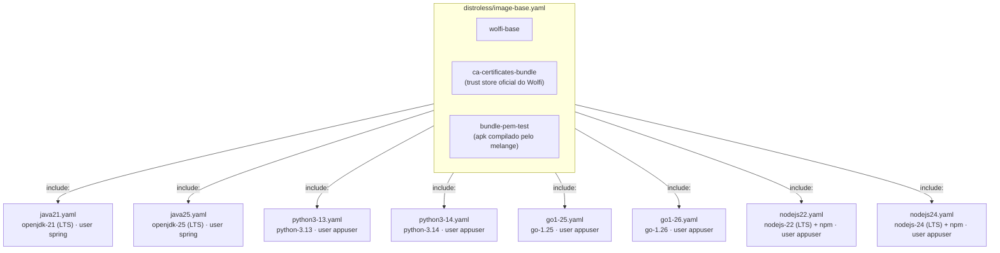
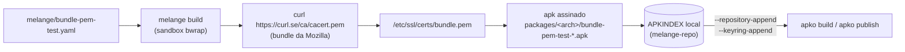
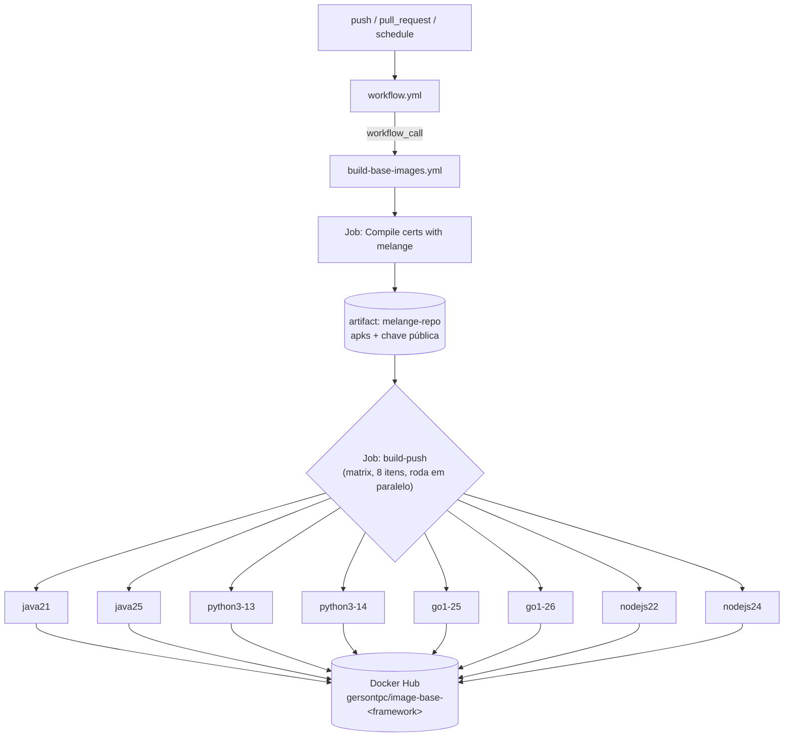
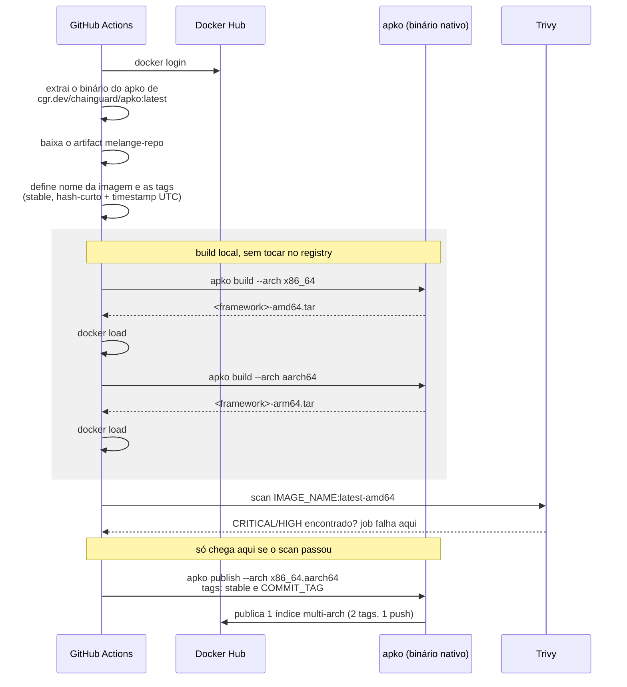

## Distroless

<p align="center">
  
</p>

As imagens "Distroless" contêm apenas seu aplicativo e suas dependências de tempo de execução. Elas não contêm gerenciadores de pacotes, shells ou quaisquer outros programas que você esperaria encontrar em uma distribuição Linux padrão.

Restringir o que está em seu contêiner de tempo de execução precisamente ao que é necessário para seu aplicativo é uma prática recomendada, principalemente em ambientes produtivos. É ai que o distroless vem para ajudar a resolver este problema, criando imagens somente com o que é necessário.

> Imagem distroless, não inclui o shell e qualquer outra ferramenta para ajudar no troubleshooting, para contornar este problema é necessário utilizar um [Container Efêmero](https://kubernetes.io/docs/tasks/debug/debug-application/debug-running-pod/#ephemeral-container), que serve para executar um container com uma imagem que serviria de "canivete suíço", para atachar no container da aplicação para fazer troubleshooting. Esta abordagem veremos exemplo mais a frente.

## Sobre este projeto

Este repositório gera imagens base **distroless multi-arquitetura** (`amd64`/`arm64`) para quatro linguagens/runtimes — **Java, Python, Go e Node.js**, cada uma com **duas versões suportadas em paralelo** — usando [apko](https://github.com/chainguard-dev/apko) (pacotes do [Wolfi](https://github.com/wolfi-dev), sem Dockerfile) e [melange](https://github.com/chainguard-dev/melange) (para compilar um pacote `.apk` próprio com um `bundle.pem`). O pipeline builda, escaneia com [Trivy](https://github.com/aquasecurity/trivy) e publica as imagens no Docker Hub via um **workflow reusável** do GitHub Actions.

### Estrutura do repositório

```
distroless/image-base.yaml   # base comum: wolfi-base + ca-certificates-bundle + bundle-pem-test
frameworks/
  java21.yaml                 # openjdk-21 (LTS)
  java25.yaml                 # openjdk-25 (LTS mais recente)
  python3-13.yaml             # python-3.13
  python3-14.yaml              # python-3.14 (mais recente)
  go1-25.yaml                   # go-1.25
  go1-26.yaml                    # go-1.26 (mais recente)
  nodejs22.yaml                   # nodejs-22 (LTS em manutenção)
  nodejs24.yaml                    # nodejs-24 (LTS ativa)
melange/
  bundle-pem-test.yaml         # gera o apk com o bundle.pem (Mozilla CA bundle)
.github/workflows/
  workflow.yml                 # dispara o pipeline (push/PR/schedule)
  build-base-images.yml        # workflow reusável: build + scan + publish
```

### Como as imagens são compostas

Todo `frameworks/<nome>.yaml` usa `include: distroless/image-base.yaml`, herdando os pacotes comuns (o `apko` faz *merge* das listas de pacotes, não substitui) e adicionando só o runtime específico e um usuário non-root próprio. Cada linguagem tem dois arquivos — as **duas últimas versões consideradas estáveis/LTS**:


```mermaid
flowchart TD
    subgraph Base["distroless/image-base.yaml"]
        B1["wolfi-base"]
        B2["ca-certificates-bundle<br/>(trust store oficial do Wolfi)"]
        B3["bundle-pem-test<br/>(apk compilado pelo melange)"]
    end

    Base -- "include:" --> J1["java21.yaml<br/>openjdk-21 (LTS) · user spring"]
    Base -- "include:" --> J2["java25.yaml<br/>openjdk-25 (LTS) · user spring"]
    Base -- "include:" --> P1["python3-13.yaml<br/>python-3.13 · user appuser"]
    Base -- "include:" --> P2["python3-14.yaml<br/>python-3.14 · user appuser"]
    Base -- "include:" --> G1["go1-25.yaml<br/>go-1.25 · user appuser"]
    Base -- "include:" --> G2["go1-26.yaml<br/>go-1.26 · user appuser"]
    Base -- "include:" --> N1["nodejs22.yaml<br/>nodejs-22 (LTS) + npm · user appuser"]
    Base -- "include:" --> N2["nodejs24.yaml<br/>nodejs-24 (LTS) + npm · user appuser"]
```

Critério de escolha das versões (no momento em que este README foi escrito):

| Linguagem | Versão A | Versão B | Por quê |
|---|---|---|---|
| Java | `openjdk-21` | `openjdk-25` | as duas últimas LTS (Java só recebe LTS a cada ~2 anos: 17, 21, 25) |
| Node.js | `nodejs-22` | `nodejs-24` | as duas últimas LTS (22 em Maintenance, 24 em Active LTS; 26 ainda é "Current", não é LTS) |
| Python | `python-3.13` | `python-3.14` | as duas últimas minors estáveis (Python não tem trilha LTS separada) |
| Go | `go-1.25` | `go-1.26` | as duas últimas minors estáveis (Go também não tem trilha LTS separada) |

O Wolfi é um repositório rolling-release, então cada `apko build`/`apko publish` já puxa o patch mais recente de cada uma dessas linhas automaticamente (ex.: `openjdk-21` sempre traz o último `21.0.x`).

> **Nota:** o pacote `nodejs-*` do Wolfi não traz `npm` funcional sozinho — o `npm` usa `#!/usr/bin/env node` no shebang e o `/usr/bin/env` só existe se o pacote `busybox` também for instalado. Por isso `nodejs22.yaml`/`nodejs24.yaml` incluem `busybox` explicitamente.

### O pacote `bundle-pem-test` (melange)

O melange builda um pacote `.apk` próprio que baixa o bundle de certificados da Mozilla (a mesma fonte usada pelo `curl`/`certifi`) e o instala em `/etc/ssl/certs/bundle.pem`. Esse `.apk`, junto com o índice assinado, vira um repositório local que o `apko` consome via `--repository-append`/`--keyring-append` — sem precisar publicar esse pacote em nenhum repositório público.


```mermaid
flowchart LR
    A["melange/bundle-pem-test.yaml"] --> B["melange build<br/>(sandbox bwrap)"]
    B --> C["curl https://curl.se/ca/cacert.pem<br/>(bundle da Mozilla)"]
    C --> D["/etc/ssl/certs/bundle.pem"]
    D --> E["apk assinado<br/>packages/&lt;arch&gt;/bundle-pem-test-*.apk"]
    E --> F[("APKINDEX local<br/>(melange-repo)")]
    F -- "--repository-append<br/>--keyring-append" --> G["apko build / apko publish"]
```

### Pipeline de CI/CD (GitHub Actions)

O `workflow.yml` apenas dispara (`push` em `main`, `pull_request` e um `schedule` diário) o workflow reusável `build-base-images.yml`, que faz todo o trabalho:


```mermaid
flowchart TD
    T["push / pull_request / schedule"] --> W["workflow.yml"]
    W -- "workflow_call" --> R["build-base-images.yml"]

    R --> M["Job: Compile certs with melange"]
    M --> AR[("artifact: melange-repo<br/>apks + chave pública")]

    AR --> X{"Job: build-push<br/>(matrix, 8 itens, roda em paralelo)"}
    X --> J1["java21"]
    X --> J2["java25"]
    X --> J3["python3-13"]
    X --> J4["python3-14"]
    X --> J5["go1-25"]
    X --> J6["go1-26"]
    X --> J7["nodejs22"]
    X --> J8["nodejs24"]

    J1 & J2 & J3 & J4 & J5 & J6 & J7 & J8 --> DH[("Docker Hub<br/>gersontpc/image-base-&lt;framework&gt;")]
```

Dentro de cada item da matrix (um framework/versão), a ordem dos passos garante que **o scan de vulnerabilidades roda antes de qualquer push**, e que o multi-arch é publicado num único comando atômico (sem tags soltas do tipo `latest-amd64`/`latest-arm64` ficando visíveis no registry):


```mermaid
sequenceDiagram
    participant CI as GitHub Actions
    participant DH as Docker Hub
    participant APKO as apko (binário nativo)
    participant TRIVY as Trivy

    CI->>DH: docker login
    CI->>CI: extrai o binário do apko de<br/>cgr.dev/chainguard/apko:latest
    CI->>CI: baixa o artifact melange-repo
    CI->>CI: define nome da imagem e as tags<br/>(stable, hash-curto + timestamp UTC)

    rect rgb(240, 240, 240)
        note over CI,APKO: build local, sem tocar no registry
        CI->>APKO: apko build --arch x86_64
        APKO-->>CI: <framework>-amd64.tar
        CI->>CI: docker load
        CI->>APKO: apko build --arch aarch64
        APKO-->>CI: <framework>-arm64.tar
        CI->>CI: docker load
    end

    CI->>TRIVY: scan IMAGE_NAME:latest-amd64
    TRIVY-->>CI: CRITICAL/HIGH encontrado? job falha aqui

    note over CI,APKO: só chega aqui se o scan passou
    CI->>APKO: apko publish --arch x86_64,aarch64<br/>tags: stable e COMMIT_TAG
    APKO->>DH: publica 1 índice multi-arch (2 tags, 1 push)
```

Nomenclatura final da imagem publicada: `gersontpc/image-base-<framework>:stable` e `gersontpc/image-base-<framework>:<hash-do-commit>-<timestamp-utc>` — por exemplo `gersontpc/image-base-nodejs24:stable` e `gersontpc/image-base-nodejs24:eff8551-20260701040103`. Não existe mais tag `latest`: `stable` é a tag "móvel" (sempre aponta para o último build que passou no scan) e a tag com hash+timestamp é a referência imutável daquele build específico.

Alguns detalhes de design que valem a pena registrar:

- **`apko build` (local) vs `apko publish` (registry):** o `apko build` só grava um `.tar` local, então é usado para montar a imagem que o Trivy escaneia, sem nunca tocar no Docker Hub. Como os builds do apko são reprodutíveis, o `apko publish` gera exatamente o mesmo digest que foi escaneado.
- **Sem tags soltas por arquitetura:** `docker manifest create` (a abordagem "clássica") só resolve referências que já existem no registry remoto — obrigaria a dar push de `latest-amd64`/`latest-arm64` antes de criar a lista multi-arch, e essas tags ficariam visíveis no Docker Hub. `apko publish` builda e publica os dois arches num único índice, então essas tags intermediárias nunca chegam a existir no registry.
- **`apko` "nativo" em vez de via `docker run`:** o binário é extraído da própria imagem `cgr.dev/chainguard/apko:latest` (`docker create` + `docker cp`) e roda direto no runner. Isso garante a versão *latest stable* do apko e permite que ele reaproveite as credenciais do `docker/login-action` (`~/.docker/config.json`) sem precisar montar volumes para simular o `$HOME` de um container.
- **QEMU só no job do melange:** o `apko` apenas extrai pacotes `.apk` (não executa nada), então builda `aarch64` num runner `amd64` sem emulação. Já o `melange` **executa** o pipeline do pacote (o `curl` que baixa o bundle da Mozilla) dentro de um sandbox `bwrap` — por isso só esse job precisa do `docker/setup-qemu-action`.
- **Matrix = push em paralelo:** os 8 frameworks/versões (`java21`, `java25`, `python3-13`, `python3-14`, `go1-25`, `go1-26`, `nodejs22`, `nodejs24`) são itens de uma `strategy.matrix` com `fail-fast: false`, então o GitHub Actions builda/escaneia/publica os oito ao mesmo tempo, e uma falha em um deles não cancela os demais.
